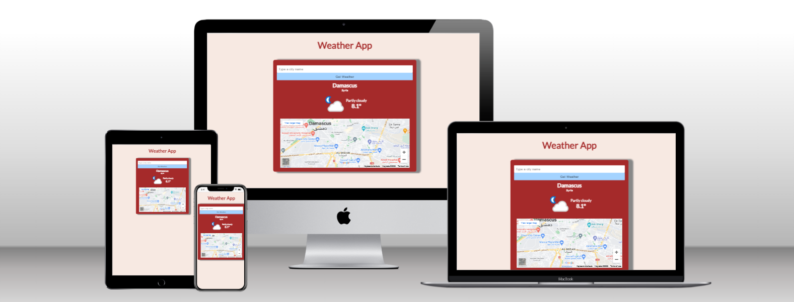

# Kruger Star Weather App 

>I created this project using React, Html+CSS only, if you want to see a live version, check the live demo section down below

# Preview of the website

>Wheather app is a simple applicaiton that give you the weather in the area you want, this project was implemented with help of hooks 
useEffect and useState.

## Built with

- JavaScript
- React
- Html+CSS 
- Netlify

## Live Demo

<a href="https://weather-app-kjj.netlify.app/">Live Demo</a>

## Run it locally

 ### Setup

 - Clone this repo using `git clone https://github.com/Kenoisplaying/weatherApp`

 ### Commands

 - `npm i`
 - `npm start`

## Author

👤 **Kenan Aljaber**

- GitHub: [@Kenoisplaying](https://github.com/Kenoisplaying)
- Instagram: [@Kinanjabr0](https://www.instagram.com/kinanjabr0/)
- LinkedIn: [Kenan Aljaber](https://www.linkedin.com/in/kenan-aljaber-a232aa187/)

## 🤝 Contributing

- [Juan Sotomayor](https://github.com/Juanse7793) - Tutor Kruger star

 ## Show your support

Give a ⭐ if you like this project!

 

